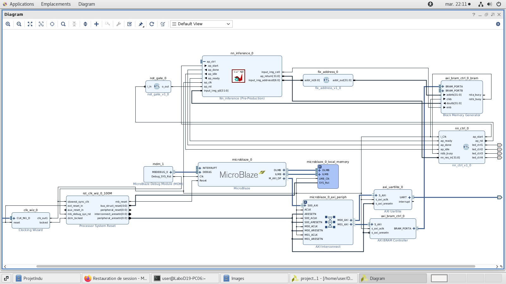

 This project was done by @1Salma and @ouma-debug for a class project and we were inspired by (https://github.com/nhma20/FPGA_AI/blob/main/README.md). We changed the material coception because we used a diffrent FPGA board.

# Machine_learning_on_Artix-7
This project demonstrates the implementation of machine learning on a Field-Programmable Gate Array (FPGA).
It involves training a neural network, exporting weights, synthesizing the network model, and interfacing with the hardware through a bare-metal application.

Project Structure

- Neural Network Training:

Define and train a neural network using a chosen architecture.
Preprocess training data and validate the model with a validation set.
Export trained weights and necessary information for deployment.

- Synthesis and Vivado IP Export:

Use FPGA synthesis tools, like Vivado HLS, to convert the neural network model into hardware description.
Export the synthesized model as a Vivado IP block for integration.

- Hardware Design Finalization:

Integrate the IP block into the overall hardware design.
Allocate FPGA resources based on neural network specifications.
Validate the hardware design through simulations and verification.

- Bare-Metal Application:

Develop a bare-metal application for communication with the FPGA.
Set up communication interfaces between the processor and FPGA.
Deploy the application on the target embedded system.

## Tools needed
Vitis HLS, Vivado, Vitis 

## 0)  workspace
- Download and unpack the dataset: https://nextcloud.sdu.dk/index.php/s/wZg4FLSxgiigJTL

## 1) Train network and extract weights with [mnist_net.py](/python/mnist_net.py)
- Loads dataset, defines, trains and tests simple network, extracts weights.
- Edit to customize network for performance and/or accuracy (`dims`, `model`, `epochs` etc)
- Run with : `python3 mnist_net.py -dataset_dir <PATH_TO_DATASET>` e.g. `python3 mnist_net.py -dataset_dir /home/nm/Downloads/MNIST_Dataset_JPG/`
- Prints information regarding the network such as training progress, an overview of the network structure, test accuracy, and a random test inference result at the end.
- Should generate several .txt files containing the weights of the network.

## 2) Create HLS project
1. Open HLS -> Create Project -> Name and Location -> Next
2. Design files: Add files -> [``matmul.cpp``](/Hls/matmul.cpp) and [``matmul.hpp``](/Hls/matmul.hpp) -> Top function -> nn_inference -> Next
3. TestBench files: Add files ->[``matmul_tb.cpp``](/Hhls/matmul_tb.cpp) -> Next
4. Select Configuration: Part -> Boards -> artix 7 -> Finish
5. (edit files to fit any network customization)
6. Replace template weights with new weights generated from network training script in step 1. All weights (by default layer2_weights, layer2_weights, and layer3_weights arrays) are stored in [``matmul.hpp``](/Hls/matmul.hpp) file.
7. Run C Simulation to verify design with testbench file. Output should match labels of input arrays (pixel values of test images) in matmul_tb.cpp.
8. Run C Synthesis (choose appropriate clock Period (ns) to match what you want in design) to synthesize design into VHDL/Verilog
   - This step outputs the estimated ressource usage, timings, and other relevant information.
9. Export RTL to obtain IP that can be imported to Vivado. IP will by default be located in HLS project folder.

## 3) Create Vivado project
1. Open Vivado -> Create Project -> Next -> Name and location, tick create subdirectory -> Next -> RTL Project, untick Do not specify sources -> Next -> Add Directories -> (the files in Vhdl).../vhdl/ -> Next -> Next -> Under Boards choose Artix-7 XC7A200T -2 FBG676C FPGA -> Next -> Finish

2. Let Vivado find custom IPs
   - Tools -> Settings -> IP -> Repository
   - Add folder with new IP (likely HLS project folder)
   - Can now add nn_inference to block design with 'Add IP' (Ctrl+i)
3. Create Block Design and add Microblaze Processing System and click 2 times on it and choose external clock and in local memory choose the highest value then Run Block Automation
4. In the section of Board, add the clock, uart module. Run Block Automation.

5. Add Axi BRAM Controller and then Run Block Automation
6. Double click axi_bram_ctrl_0 module and edit Number of BRAM interfaces to 1
7. Add Nn_inference **without** running block automation
8. From sources, drag in [``fix_address.vhd``](/vhdl/fix_address.vhd), [``not_gate.vhd``](/vhdl/not_gate.vhd), and [``nn_ctrl.vhd``](/vhdl/nn_ctrl.vhd) modules. 
   - [``nn_ctrl.vhd``](/src/vhdl/nn_ctrl.vhd): Connect all ap_* ports **except** ap_rst to the corresponding port on nn_inference module. Make all 4 led_ctrl* external. Connect nn_res_in to ap_return on nn_inference. Connect rstb_busy to corresponding port on axi_bram_ctrl_0_bram. Connect i_Clk to FCLK_CLK0 on the microblaze module.
   - [``fix_address.vhd``](/src/vhdl/fix_address.vhd): connect addr_in to input_img_address on nn_inference module. If widths do not match, double click on fix_address and edit. Expand BRAM_PORTB on axi_bram_ctrl_0_bram and connect addrb to addr_out on fix_address.
   - [``not_gate.vhd``](/src/vhdl/not_gate.vhd): Connect i_in to ap_rst on nn_ctrl. Connect o_out to ap_rst on nn_inference module.
   - nn_inference: Connect ap_clk to FCLK_CLK0 on microblaze module. Connect input_img_q0 to doutb on axi_bram_ctrl_0_bram. Connect input_img_c0 to enb on axi_bram_ctrl_0_bram.
   - Connect clkb on axi_bram_ctrl_0_bram to FCLK_CLK0.
   - Right-click anywhere in the block diagram and regenerate layout and it should look similar to the below image:

9. In sources, right click on design_1.bd (in orange) and click create wrapper and let Vivado manage it.
10. Run Synthesis (may take a while) and open Synthesized Design. In the top right corner select I/O Planning. At the bottom, select the I/O Ports window and expand Scalar ports (4).
11. Set the I/O Std of the 4 led_ctrl* ports to LVCMOS33. From led_ctrl1 to led_ctrl4, assign package pins as in the datasheet of the fpga. Ctrl+s to save.
12. Go to the block diagram, save, validate design, and then Generate Bitstream (may also take a while).
13. Finally, go to File -> Export Hardware -> Next -> Include bitstream -> Next -> Location -> Next -> Finish

## 4) Create Vitis project
1. Open Vitis -> Create platform project -> name -> Next -> Browse to where you saved the exported hardware -> Finish.
2. File -> New -> Application Project -> Next -> Select your platform project -> name -> Next -> Next -> Select Hello World -> Finish. 
3. Insert the C code from the [``helloworld.c``](/src/vitis/helloworld.c) file in this repository. Make sure NUM_INPUTS matches the parameters of the network and hardware. 
4. Save and right-click application project to build it. 
5. Right-click application project and Run As -> Launch Hardware to deploy on artix 7 board. Some of the 4 LED[0:3] should light up. 

## 5) Test FPGA neural network with uart_test_nn.py
1. Find port number of artix 7 board (e.g. `ls /dev/` and look for ttyUSB*)

2. Run [``uart_test_nn.py``](/python/uart_test_nn.py) with port as argument, e.g.: `python3 uart_test_nn.py -port /dev/ttyUSB1`
3. The script sends a random test image from the dataset to the board over UART and outputs the corresponding label. Hopefully LED[0:3] lights up in the same binary number as the test image label.

From the host PC test images are sent to the PYNQ-Z2 board via UART. The baremetal software application acts as an interface between host PC and hardware and send the test image to the hardware inference module through BRAM. The inference result is displayed via the onboard LEDs and sent back through the software application to the host PC.

Created by Oumayma El asri and Salma Touiti, based on the project of Nicolaj Malle, PhD fellow at [University of Southern Denmark](https://www.sdu.dk/en) > [UAS Center](https://www.sdu.dk/en/forskning/sduuascenter) > [DIII](https://www.sdu.dk/en/forskning/sduuascenter/researchareas/diii)
N. Malle and E. Ebeid, "Open-Source Educational Platform for FPGA Accelerated AI in Robotics," 2022 8th International Conference on Mechatronics and Robotics Engineering (ICMRE), 2022, pp. 112-115, doi: 10.1109/ICMRE54455.2022.9734102.
